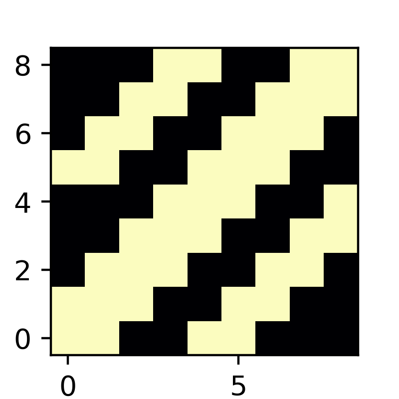
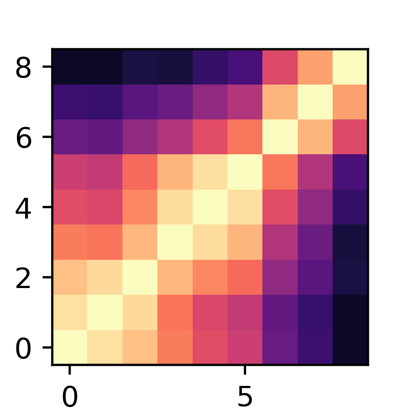
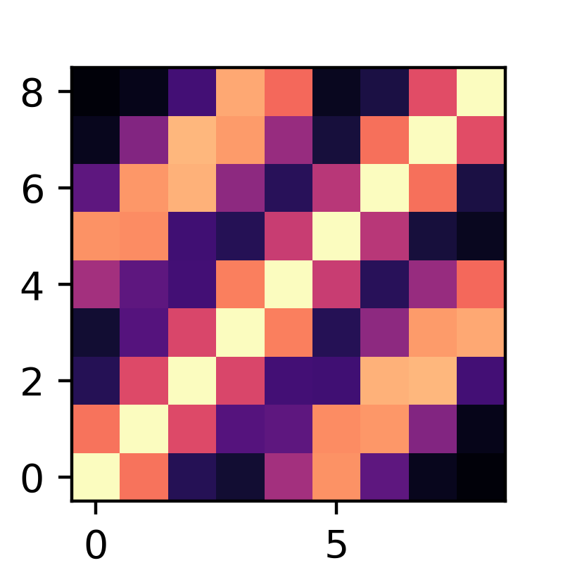

**This Repo contains:**

**Implementation of Unbiased CKA in Pytorch**

Implementing both RBF and Linear kernels Based on Eq.2 in [paper](https://arxiv.org/abs/2010.15327)

**Implemetation of CKA Engineering**

Target CKA maps are used as the objective for the CKA map loss in [paper](https://arxiv.org/abs/2210.16156) with same model architecture and accuracy

**Implementation of dCKA**

[Deconfounded CKA](https://arxiv.org/abs/2202.00095)
